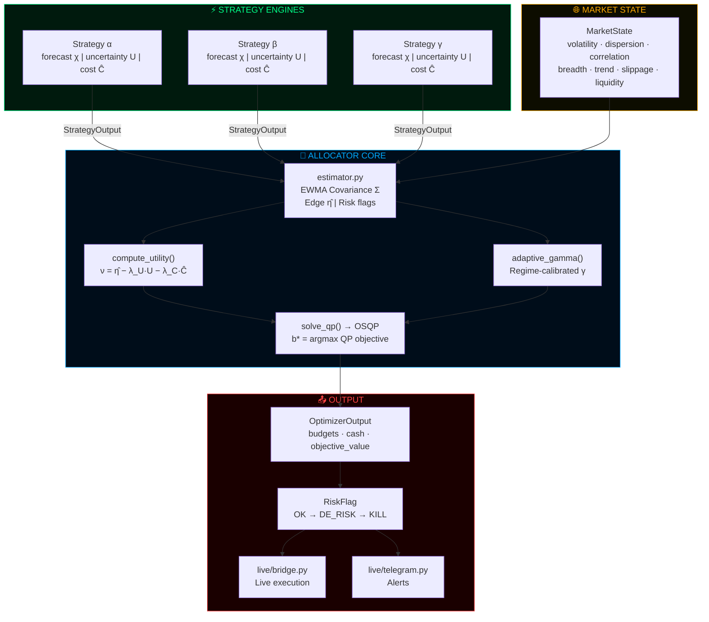

<div align="center">


<br/>

[](https://git.io/typing-svg)

<br/>


</div>

---

```
╔══════════════════════════════════════════════════════════════════════════════╗
║  ⚡  REGIME-AWARE MULTI-STRATEGY BUDGET ALLOCATOR  ⚡                        ║
║                                                                              ║
║  Quadratic Programming optimizer with adaptive gamma and EWMA covariance.   ║
║  Risk flags: OK → DE_RISK → KILL. Live bridge. Telegram alerts.             ║
║  NOT a toy. NOT a black box. Every coefficient is accountable.              ║
╚══════════════════════════════════════════════════════════════════════════════╝
```

<br/>

## > WHAT_IT_DOES.exe

This system takes signals from **N independent strategy engines**, scores their utility against live market state, and solves a **Quadratic Program** to produce optimal capital budgets — every cycle, with full risk gating.

Three regime signals govern everything: **volatility**, **correlation breadth**, and **trend**. When regimes shift, `adaptive_gamma` recalibrates risk aversion automatically. No manual intervention.

**The core solve:**

```
b* = argmax_b [ νᵀb − (γ/2) bᵀΣb − λ_turn ‖b − b_prev‖₁ ]

subject to:   1ᵀb ≤ 1    (full investment constraint)
              b ≥ 0        (no short selling)
```

Where `ν = η̂ − λ_U · U − λ_C · Ĉ` is the per-strategy utility score:
- `η̂` — estimated edge (forecast × signal quality)
- `U` — uncertainty penalty
- `Ĉ` — transaction cost estimate

---

## > ARCHITECTURE.exe



---

## > SCHEMAS.exe

<details>
<summary><strong>▶ Click to expand — Data contracts</strong></summary>

```python
# Strategy signal — what each engine produces
class StrategyOutput(BaseModel):
    strategy_id: str
    timestamp: datetime
    forecast: float        # χ — expected return
    uncertainty: float     # U — confidence interval width
    cost_estimate: float   # Ĉ — round-trip transaction cost
    metadata: dict

# Live market environment
class MarketState(BaseModel):
    volatility: float      # Realised vol (annualised)
    dispersion: float      # Cross-strategy return spread
    correlation: float     # Average pairwise correlation
    breadth: float         # % strategies with positive edge
    trend: float           # Trend strength signal [-1, 1]
    slippage: float        # Expected market impact
    liquidity: float       # Liquidity score

# Full input to allocator
class AllocatorInput(BaseModel):
    timestamp: datetime
    market_state: MarketState
    strategy_outputs: List[StrategyOutput]
    prev_budgets: Dict[str, float]

# Solver output
class OptimizerOutput(BaseModel):
    budgets: Dict[str, float]   # strategy_id → capital fraction
    cash: float                 # Unallocated capital
    risk_flags: List[RiskFlag]  # OK / DE_RISK / KILL
    objective_value: float
    solver_status: str
```

</details>

---

## > ENGINE.exe

<details>
<summary><strong>▶ Click to expand — AllocatorEngine.step() pipeline</strong></summary>

```
STEP PIPELINE (per cycle):
──────────────────────────
1.  Build arrays          →  eta_hat[], U[], C_hat[] per strategy
2.  Accumulate history    →  rolling return matrix
3.  estimate_covariance() →  EWMA Σ with halflife + slippage overlay
4.  adaptive_gamma()      →  regime-aware risk aversion scalar γ
5.  compute_utility()     →  ν[] per strategy
6.  solve_qp()            →  OSQP → OptimizerOutput
7.  Update b_prev         →  turnover penalty next cycle
8.  Emit risk flags       →  OK | DE_RISK | KILL
```

**Risk gate logic:**
- `OK` — budgets as solved
- `DE_RISK` — scale all budgets down, increase cash buffer
- `KILL` — zero all positions, full cash

</details>

---

## > QUICKSTART.exe

```bash
# 1. Clone and install
git clone https://github.com/LORD-ZYTHOZ/regime-aware-strategy-allocator.git
cd regime-aware-strategy-allocator
pip install -r requirements.txt

# 2. Run the demo
python demo.py

# 3. Run backtest
python -c "
from allocator.backtest import run_backtest, compute_metrics
import pandas as pd

returns = pd.read_csv('strategy_returns.csv', index_col=0, parse_dates=True)
allocations, portfolio = run_backtest(returns)
metrics = compute_metrics(portfolio)
print(metrics)
"

# 4. Stress test all synthetic scenarios
python -c "
from allocator.stress import run_all_synthetic_scenarios
results = run_all_synthetic_scenarios()
"
```

---

## > LIVE_BRIDGE.exe

```bash
# Start live execution with PM2
cd live/
pm2 start ecosystem.config.js

# Telegram alerts auto-fire on:
#   - KILL flag trigger
#   - DE_RISK event
#   - Rebalance cycle complete
#   - Solver non-optimal status
```

---

## > STRESS_TEST.exe

```
Synthetic scenario battery covers:
┌─────────────────────────────────────────────────────────┐
│  ✓ Vol spike (2008-style)     ✓ Correlation breakdown   │
│  ✓ Liquidity crunch           ✓ Trend reversal          │
│  ✓ Strategy signal failure    ✓ Cost blowout            │
│  ✓ All flags → KILL           ✓ Recovery cycle          │
└─────────────────────────────────────────────────────────┘
```

---

## > RISK_FLAGS.exe

```
┌──────────────┬──────────────────────────────────────────────────────────────┐
│  FLAG        │  BEHAVIOR                                                    │
├──────────────┼──────────────────────────────────────────────────────────────┤
│  ✅ OK       │  Execute QP-optimal budgets as solved                        │
│  ⚠️  DE_RISK │  Scale budgets down · increase cash buffer · alert Telegram  │
│  🔴 KILL     │  Zero all positions · full cash · alert Telegram + log       │
└──────────────┴──────────────────────────────────────────────────────────────┘
```

---

## > CONFIG.exe

<details>
<summary><strong>▶ Click to expand — Key parameters</strong></summary>

```python
class EstimatorConfig:
    ewma_halflife: int       # Covariance halflife in days
    lambda_uncertainty: float  # λ_U — uncertainty penalty weight
    lambda_cost: float         # λ_C — cost penalty weight

class OptimizerConfig:
    gamma_base: float          # Base risk aversion
    lambda_turnover: float     # λ_turn — turnover penalty weight
    max_budget_single: float   # Per-strategy cap
    min_cash: float            # Minimum cash reserve
```

</details>

---

<div align="center">

<br/>

```
┌─────────────────────────────────────────────────────┐
│   Built in Sydney · Regime-aware since day one      │
│   Every cycle. Every regime. No manual override.    │
└─────────────────────────────────────────────────────┘
```

<br/>


</div>
